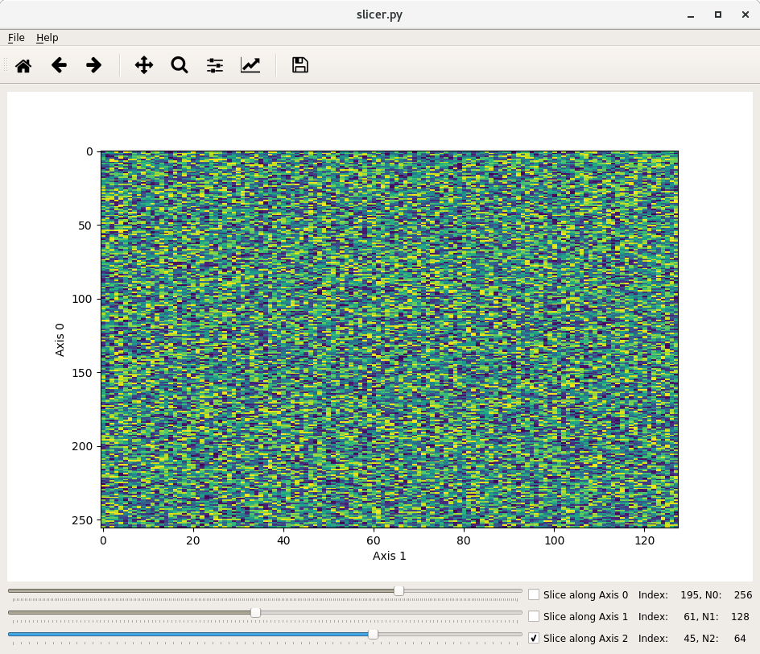

# Slicer
Visualise 1D or 2D slices of an N-dimensional Numpy array.



I have always wanted a straightforward, simple, and fast way of plotting 1D, and 2D slices of a multidimensional array. No frills, no software issues, just raw visualisation goodness. Since discovering Pyside2 I have finally been able to realise this dream....

# Installation

You need to install 

* **Pyside2**
* **Matplotlib**
* **Qt5**

This is easy to do with Anaconda Python.

```bash
conda config --add channels conda-forge
conda install pyside2
```

# Running

In the last few lines of the script I create a Numpy array of random values and send it to the application. Where you get your numpy array from is up to you.

# Nice to haves

* It would be very nice if we could have a way to control the color scaling in the image by way of a histogram, like PyQTGraph's [HistogramLUTWidget](http://www.pyqtgraph.org/documentation/widgets/histogramlutwidget.html) without going back to pyside and Qt4.

Have fun, and by all means send me a pull request if you found a way to make it better!

